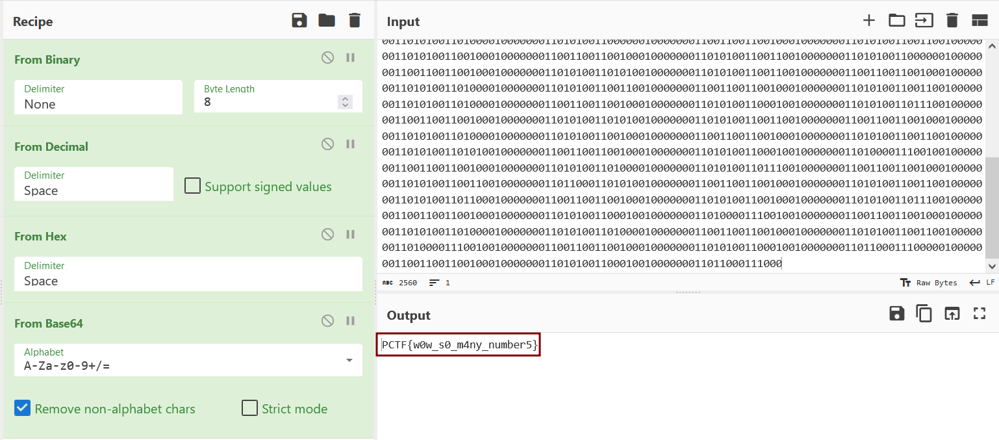

# Multi-Numeral
#### Write-up author : [JustKhal](https://github.com/JustKhal)

## DESCRIPTION:
Much numbers, many wows.

## STEPS:
1. We can just use CyberChef to decode it from binary -> decimal -> hex -> base64 -> string
<p align="center"></p>

## FLAG:

```
PCTF{w0w_s0_m4ny_number5}
```