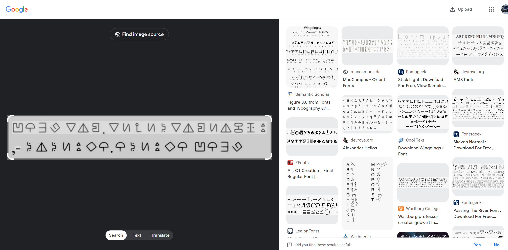
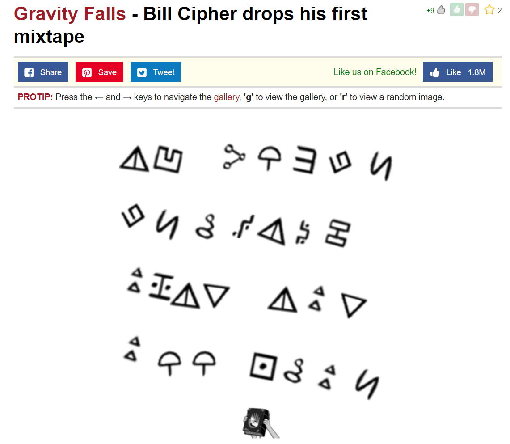
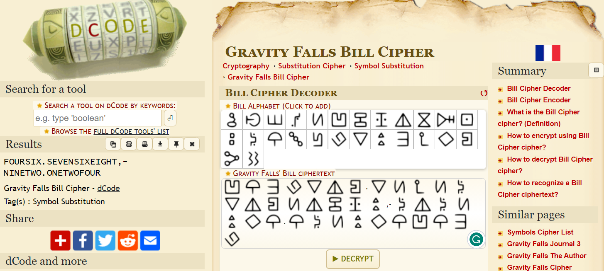
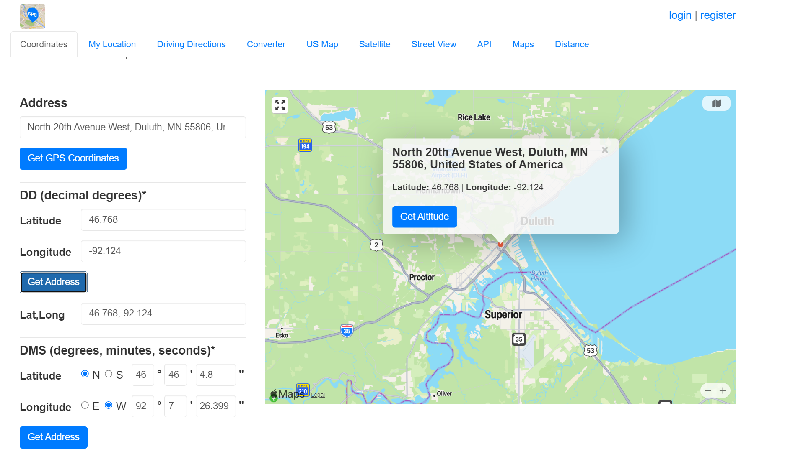

# My phone!
#### Write-up author : [Severable](https://github.com/Severable)

## DESCRIPTION:
Some weird triangle man stole my phone, he taunted me by sending me his location but it seems to be encrypted with some odd cipher I've never seen before, could you please help me get my phone back?

_Flag format: PCTF{city name}_

## STEPS:
1. Search the image with Google Lens
<p align="center"></p>

2. We found the symbols, it's a Gravity Falls Bill Cipher symbols.
<p align="center"></p>

3. We use a decoder from https://www.dcode.fr/gravity-falls-bill-cipher to decode the cipher which resulted in coordinates.
<p align="center"></p>

4. Search the coordinates to find the city name.
<p align="center"></p>

## FLAG:

```
PCTF{duluth}
```