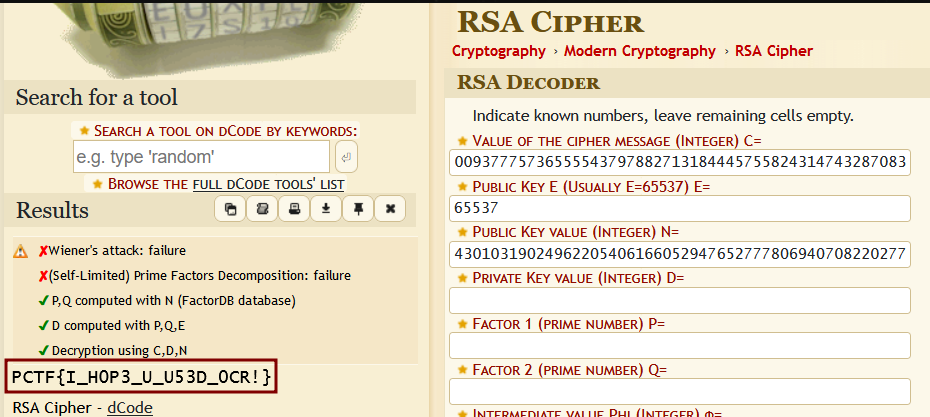

# ReReCaptcha
#### Write-up author : [JustKhal](https://github.com/JustKhal)

## DESCRIPTION:
Boy these captcha's are getting out of hand! First it was some numbers and letters, then they wanted me to find all the crosswalks and stoplights, now, I just got these 4 images in a zip file as the captcha.

## STEPS:
1. So it gives us a zip file that contains 4 png files which each of them contains parts of RSA such as CT (Cipher Text), E, P, and Q. So first we gotta use OCR so we can get the text from the image

2. After that, since we know P*Q equals the public key value, so we multiply P with Q

3. We have the CT, E, and publc key value. Now we just gotta decrypt it, we can use online decoder like https://www.dcode.fr/rsa-cipher
<p align="center"></p>

## FLAG:

```
PCTF{I_H0P3_U_U53D_0CR!}
```