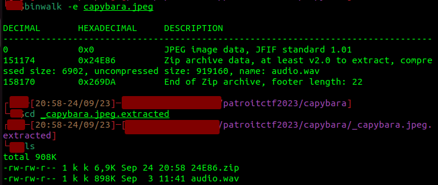
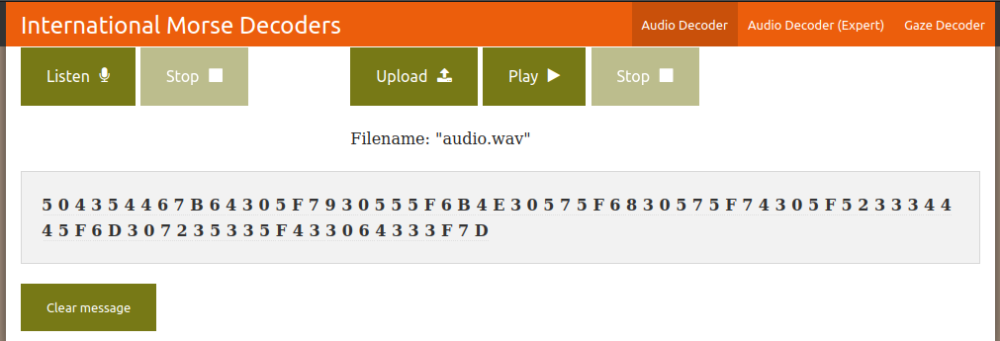
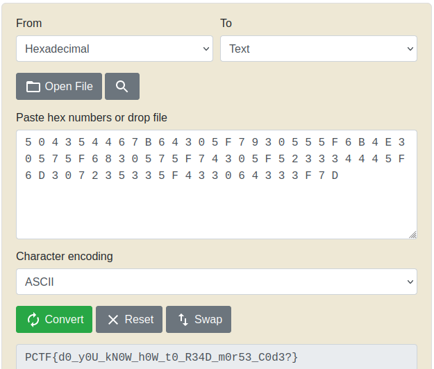

# Capybara
#### Write-up author : [JustKhal](https://github.com/JustKhal)

## DESCRIPTION:
What a cute picture of a capybara!

## STEPS:
1. Use binwalk
```
binwalk -e capybara.jpeg
```
<p align="center"></p>

2. As you can see, there's an audio file and when we listen to it, it sounds like morse code, so we morse code decoder online https://morsecode.world/international/decoder/audio-decoder-adaptive.html
<p align="center"></p>

3. Lastly, we decode the hex to string
<p align="center"></p>

## FLAG:

```
PCTF{d0_y0U_kN0W_h0W_t0_R34D_m0r53_C0d3?}
```
