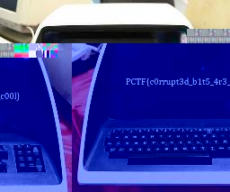

# Unsupported Format
#### Write-up author : [JustKhal](https://github.com/JustKhal)
## DESCRIPTION:
My friend sent me a picture of his brand new computer, but something strange happened to it and now it says "Unsupported Format" when I try to open it. Can you try to help me recover the image?
## HINT(S):

Hint 1: I hope nothing got corrupted in the transfer!

## STEPS:
1. I just use this website to repair the image https://repairit.wondershare.com/online-photo-repair.html, and then the image is "fixed"
<p align="center"></p>

## FLAG:

```
PCTF{c0rrupt3d_b1t5_4r3_c00l}
```

