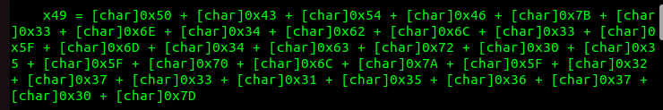

# congratulations
#### Write-up author : [JustKhal](https://github.com/JustKhal)

## DESCRIPTION:
Congratulations, here's an email attatchment.

## STEPS:
1. Use olevba to see the macros in Congratulations.docm
```
olevba Congratulations.docm
```
<p align="center"></p>

2. Then convert/decode hex to string

## FLAG:

```
PCTF{3n4bl3_m4cr05_plz_27315670}
```