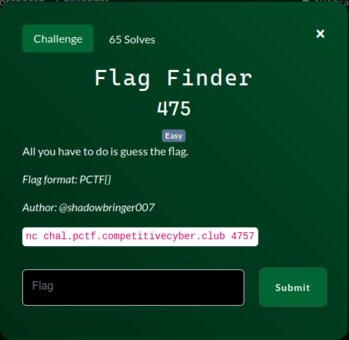

# FlagFinder
#### Write-up author : [JustKhal](https://github.com/JustKhal)

## DESCRIPTION:
All you have to do is find the flag.
<p align="center"></p>

## STEPS:
1. The challenge doesn't provide any file and just a netcat connection. So first i tried to connect to it and then input pctf{test} and it gave me an output confirming that User input and Flag input are the same for the first 5 characters.
2. So from that we can see that if the character is right it will give an output until the character is wrong, so we literally have to guess it. So then i made this Python script to guess the flag
```py
from pwn import *
import itertools

middle_charset = string.ascii_lowercase + string.digits + "_"

middle_length = 19 - len("pctf{}")

def bruteforce_string():
    host = "chal.pctf.competitivecyber.club"
    port = 4757

    for combination in itertools.product(middle_charset, repeat=middle_length):
        r = remote(host, port)
        middle_part = ''.join(combination)
        candidate = f"pctf{{{middle_part}}}"
        print(candidate)
        r.sendlineafter("What is the password: ", candidate)
        response = r.recvlineS()

        if response.count("User input") == 19 and response.count("Flag input") == 19:
            log.success(f"Found correct string: {candidate}")
            r.close()
            return

        r.close()

bruteforce_string()
```

## FLAG:

```
pctf{Tim3ingI8N3at}
```