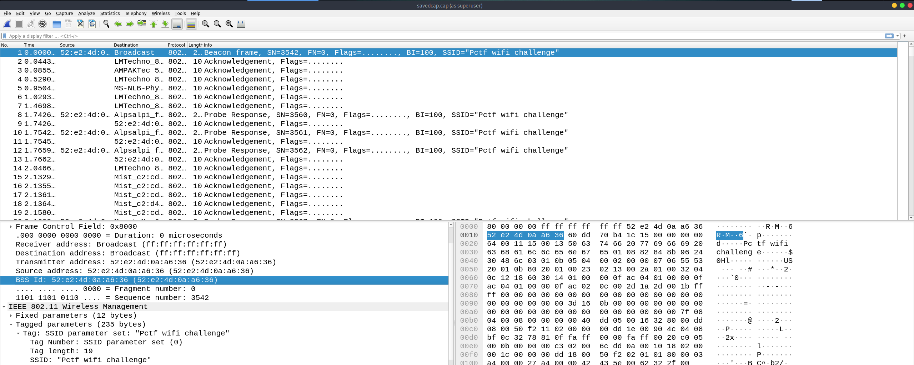

# WPA
#### Write-up author : [Severable](https://github.com/Severable)

## DESCRIPTION:
I really need to get on my friends WiFi, but he won't give me the password. I think he think's I'll mess around on his network. I started a packet capture and left it running a while, I think someone connected to the network before I stopped the capture. Can you help me?

_Flag format: PCTF{password}_

## STEPS:
1. Open the capture file in Wireshark
<p align="center"></p>

2. Find a WPA2 handshake in Wireshark, these will consist of messages like "Message 1 of 4", "Message 2 of 4", etc and export those packets.
<p align="center"></p>

3. We use Aircrack-ng and rockyou.txt to crack the wifi password.
<p align="center"></p>
<p align="center"></p>

## FLAG:

```
PCTF{qazwsxedc}
```