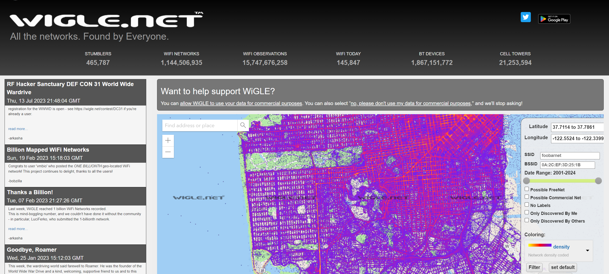
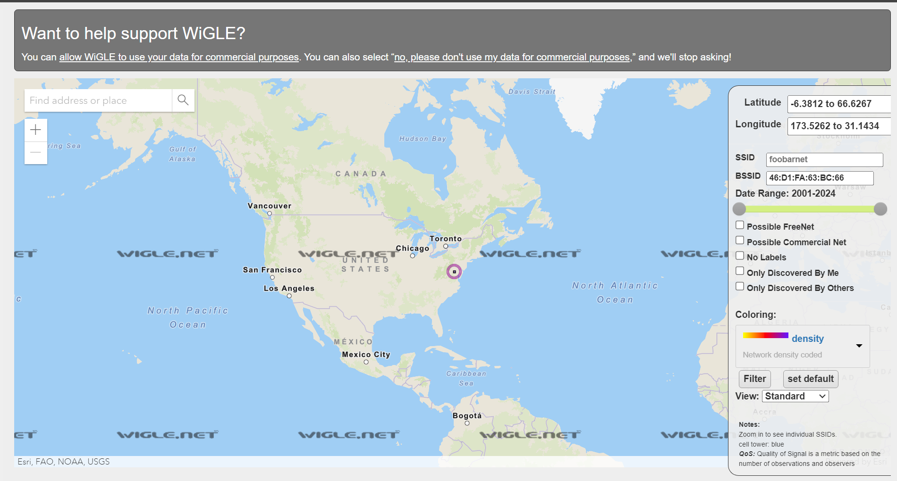
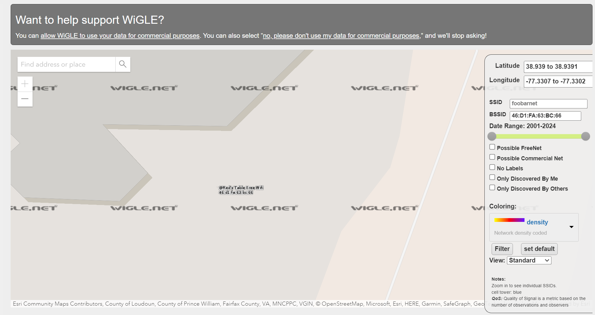

# Rouge Access Point
#### Write-up author : [Severable](https://github.com/Severable)

## DESCRIPTION:
We've received a notice from our companies EDR software that a laptop was attacked while they were on WFH. The employee says they were at home when it happened, but we suspect they were using public wifi. Our EDR software managed to capture the BSSID of the wifi (46:D1:FA:63:BC:66) network before it got disconnected, but not the SSID. Can you still find the network they were connected to?

_Flag format: PCTF{SSID}_

## STEPS:
1. We use https://wigle.net/ to find informations about the wifi SSID that we're trying to find.
<p align="center"></p>

2. By searching using the BSSID of the wifi, we can find the location and the SSID of the wifi.
<p align="center"></p>
<p align="center"></p>

## FLAG:

```
PCTF{@Red's Table Free Wifi}
```