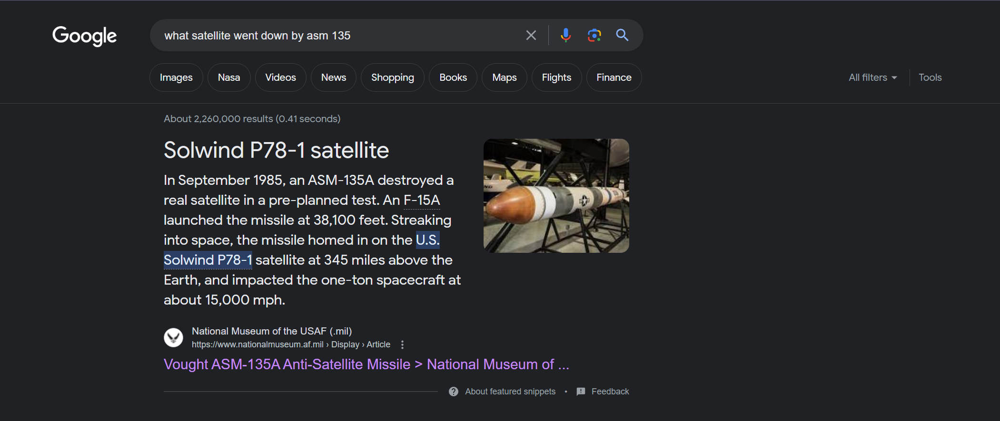
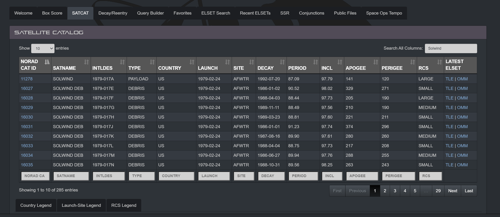
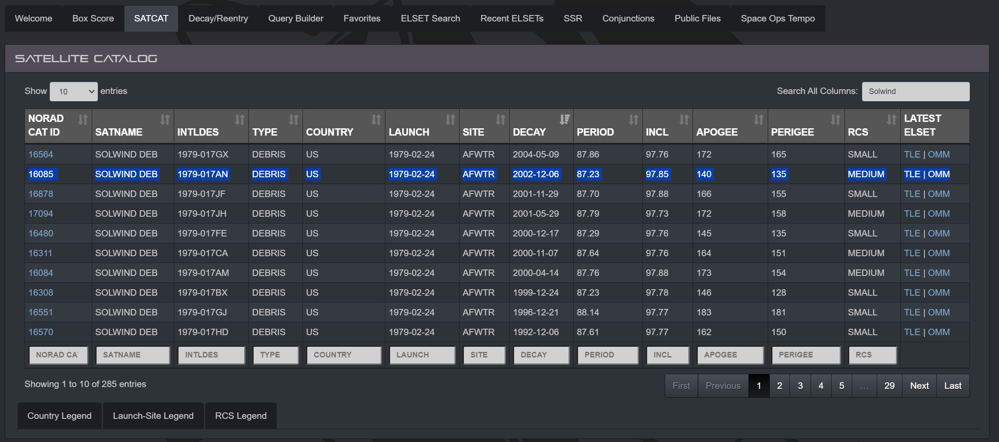

# Satellite Killer
#### Write-up author : [Severable](https://github.com/Severable)

## DESCRIPTION:
Most satellites get to live out a relatively peaceful existence in space until their orbit eventually decays and they fall back to Earth.

Most.

Back in the 80's, one poor satellite met a premature end at the hands of an ASM-135.

I would like you to find the date that the second-to-last piece of its debris fell back down to Earth (Or more realistically, its decay date).

In addition, please give me its object ID/International Code.

Flag format: PCTF{OBJECTID_YEAR-MONTH-DAY} 

_For example, for a piece of debris from the Falcon 9, the flag would look like this: PCTF{2023-028BG_2023-3-15}_

## HINT(S):

There was a lot of debris. I would recommend automating this.

## STEPS:
1. Find the name of the satellite that match the description.
<p align="center"></p>

2. After finding the name of the satellite, we find the SATCAT information of the satellite using https://www.space-track.org/
<p align="center"></p>

3. We find the Object ID and the date of the second-to-last piece of the debris by sorting the table by it's decay date.
<p align="center"></p>

## FLAG:

```
PCTF{1979-017AN_2002-12-06}
```
