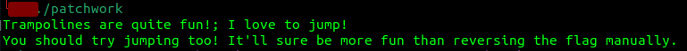
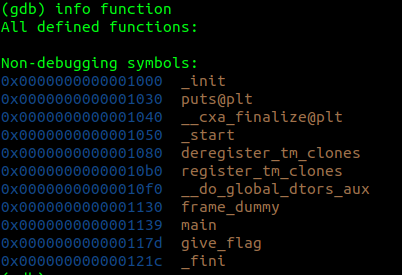
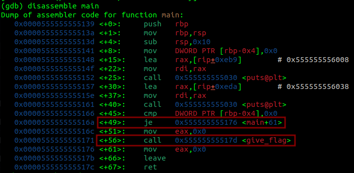
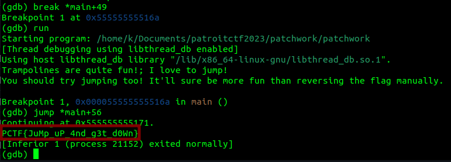

# patchwork
#### Write-up author : [JustKhal](https://github.com/JustKhal)

## DESCRIPTION:
This program should just give the flag, but I set the wrong value in the code and now it refuses to jump to the correct function. Could you patch it for me?

Flag Format: PCTF{}

## STEPS:
1. First let's see what's the output if we just run it
<p align="center"></p>

2. It appears it gives a hint that we have to "jump", so let's open it with gdb
<p align="center"></p>

3. We can see there's a function called "give_flag", but first let's disassemble main function first to see how the program works
<p align="center"></p>

4. So in the main function, it calls "give_flag" at +56, but at +49 it jumps to +61. So we have to break at or before +49 and then we jump to +56
 <p align="center"></p>

## FLAG:

```
PCTF{JuMp_uP_4nd_g3t_d0Wn}
```